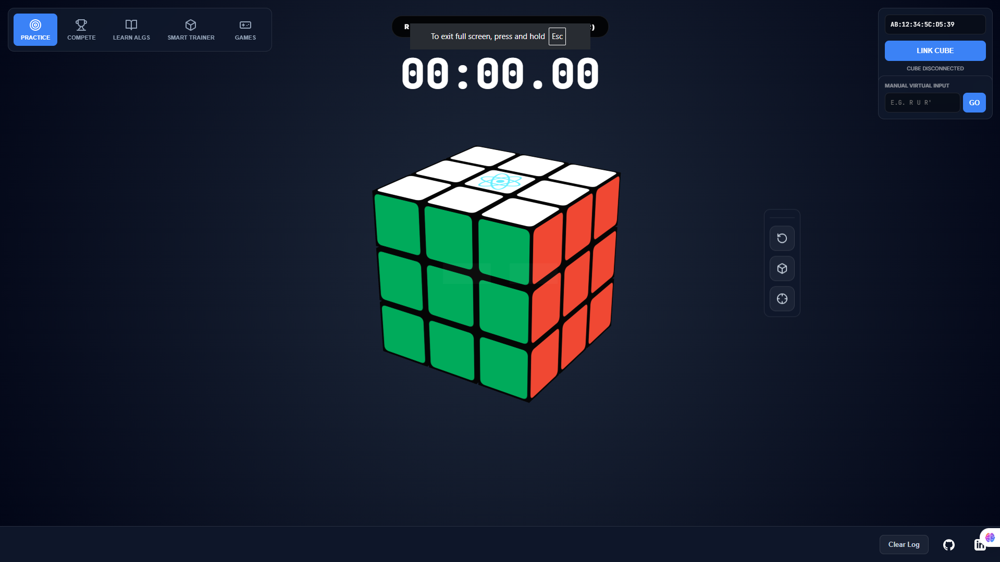
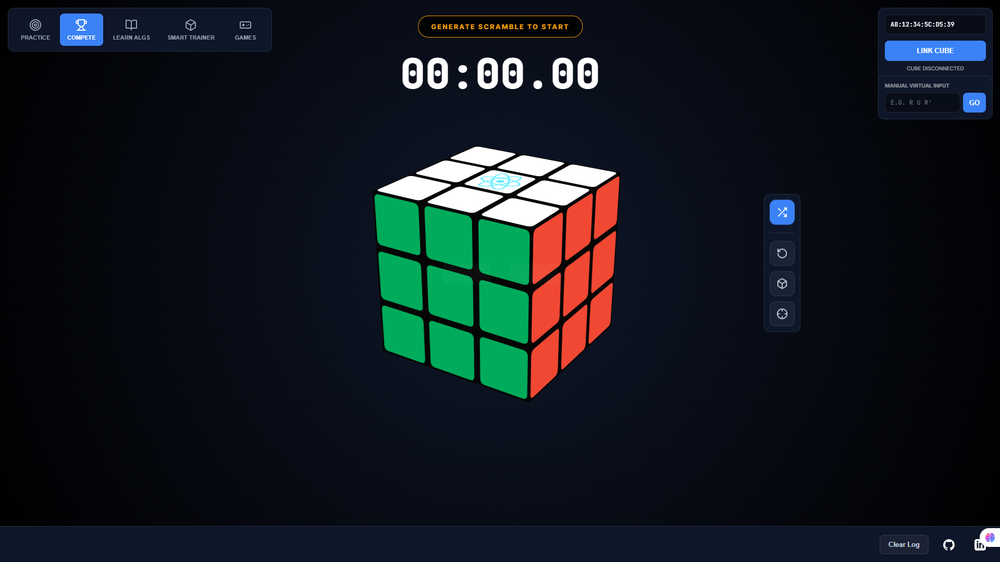
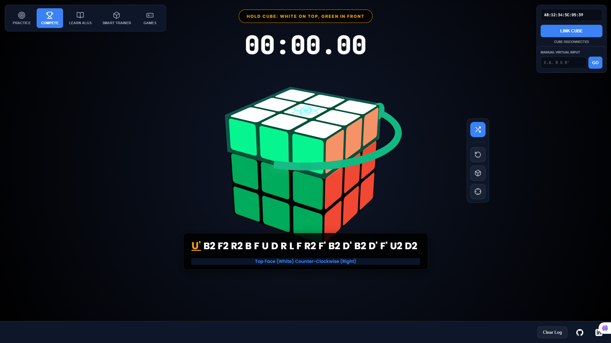
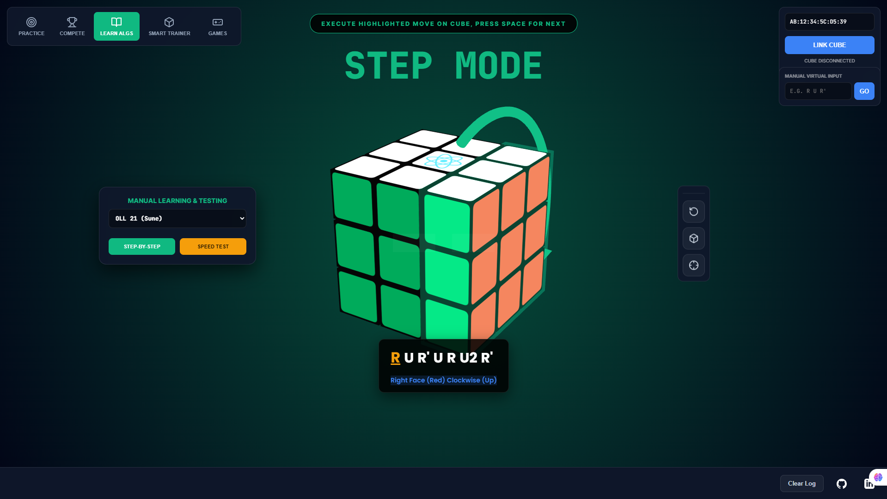
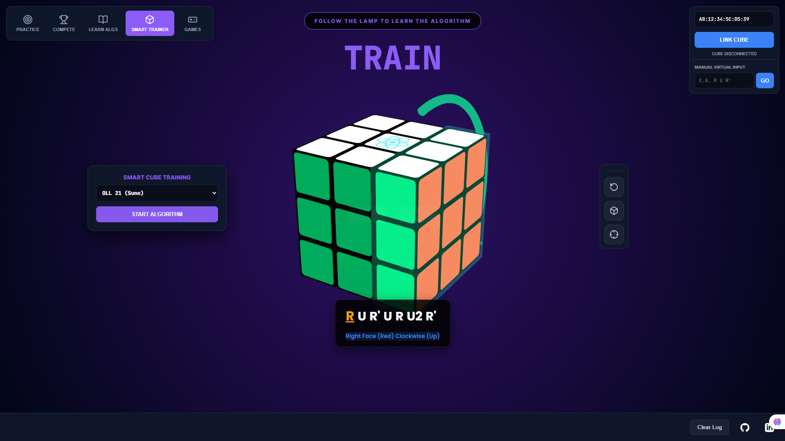
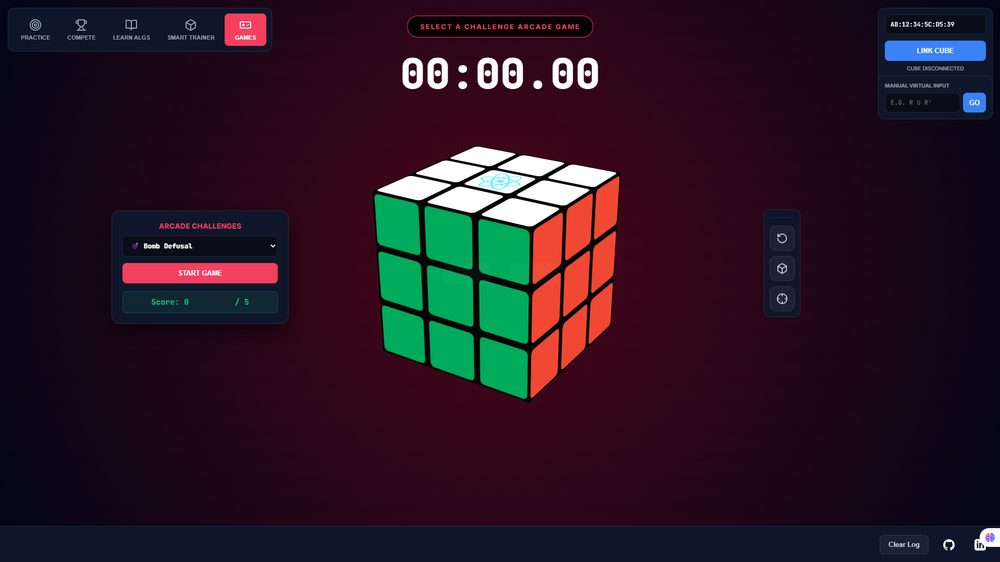

# 🧊 GAN Smart Cube 3D Tracker & CFOP Trainer

### *Transforming a physical Bluetooth toy into a professional e-sports training platform.*

[](https://youtu.be/ZVW1lP2Tbz8)


## 🌟 Overview
This project connects a physical **GAN 356 i3 Smart Cube** to a web browser via **Web Bluetooth API**, rendering its movements in real-time within a stunning 3D environment. It serves as a professional-grade **Competition Timer** and **CFOP Algorithm Trainer**, featuring holographic move hints and advanced mistake tracking.

## 🚀 Key Features
- **Real-time 3D Rendering**: Powered by Three.js with procedural cube generation and rounded sticker textures for a premium aesthetic.
- **Web Bluetooth Integration**: 100% client-side logic—no backend bridge required.
- **CFOP Trainer**: Interactive algorithm database with "Neon Cage" holographic guidance.
- **Advanced State Machine**: Manages transitions between *Scrambling*, *Inspection*, *Running*, and *Finished* states.
- **Mistake Tracker**: Detects incorrect turns and requires exact reverse moves before proceeding.
- **Neon Holograms**: Custom Torus/Cone geometry with additive blending for emissive, glowing move hints.

## 📸 Interface Gallery

| Practice Mode | Compete Mode |
| :---: | :---: |
|  |  |

| Scramble & Hints | Learn Algs (Step Mode) |
| :---: | :---: |
|  |  |

| Smart Trainer | Arcade Games |
| :---: | :---: |
|  |  |

## 📊 System Architecture & Data Flow

```mermaid
graph TD
    A[Physical GAN Cube] -- "BLE Packets (Encrypted)" --> B[Web Bluetooth API]
    B --> C{AES Decryption Engine}
    C -- "MAC-based Key" --> D[Clean Move Strings (U, R', F2)]
    D --> E[State Machine Logic]
    E --> F[3D Engine (Three.js)]
    E --> G[UI components (Timer/History)]
    F --> H[Procedural Cube Model]
    F --> I[Neon Hologram Hints]
    H -- "Dynamic Grouping" --> J[Animated 3D Rotation]
    J -- "Matrix Realignment" --> K[Stable Cube State]
```

---

## 🏗️ Technical Implementation

### 1. The 3D Engine (Three.js)
Instead of static models, the cube is built procedurally. Each of the 26 pieces is a `THREE.Group` with individual sticker textures drawn on HTML5 `<canvas>`.
- **Dynamic Grouping**: Moves are executed by identifying pieces using `getWorldPosition` and attaching them to a temporary group for rotation.
- **Easing**: Turns use an *Ease-Out Quart* function for a snappy, physical feel.
- **Matrix Realignment**: To prevent rounding errors from "exploding" the cube, every piece's position and rotation are rounded to the nearest 90 degrees after each turn.

### 2. Holographic Effects (The "Neon Cage")
We used `THREE.AdditiveBlending` and `depthWrite: false` to create glowing, translucent overlays.
- **Animated Arrows**: Curved arrows hug the cube's face using `THREE.TorusGeometry`.
- **Breathing Effect**: Opacity and light intensity are modulated using a Sine wave for a realistic neon pulse.

---

## 📜 The Journey: Challenges & Breakthroughs

### Phase 1: The Python Era (Reverse Engineering)
Initially, we attempted a Python backend using `bleak` and `Wireshark` to sniff Bluetooth packets.
- **The Obstacle**: GAN cubes use heavy AES-128-CBC encryption, with a decryption key seeded by the cube's own MAC address.
- **The Failure**: Constant firmware updates and obfuscated hardware logic led to persistent padding errors and garbage data.

### Phase 2: The Web Breakthrough
The project pivoted after discovering a custom JavaScript-native AES decryption engine capable of handling the specific S-Boxes and IV arrays used by GAN.
- **The Solution**: By moving to the **Web Bluetooth API**, we eliminated the clunky Python bridge, allowing the entire app to run directly in the browser with minimal latency.

---

## 🛠️ How to Build & Run
1. **Clone the repository**:
   ```bash
   git clone https://github.com/Abilash-Nickal/smart_cube_visualizer_trainer.git
   cd smart_cube_visualizer_trainer
   ```
2. **Run a local server**:
   Because Web Bluetooth requires a secure context (HTTPS or localhost), use a simple server:
   ```bash
   # Using Python
   python -m http.server 8000
   # Or using Node.js
   npx serve .
   ```
3. **Connect your Cube**:
   - Open Chrome or Edge.
   - Enter your cube's MAC address (found in nRF Connect) and click **LINK CUBE**.

---

## 👨‍💻 Developed By
**Abilash Nickal**
- [GitHub](https://github.com/Abilash-Nickal)
- [LinkedIn](https://www.linkedin.com/in/arumugam-abilashan-6916a2157/)

---
*Disclaimer: This project is an independent creation and is not affiliated with GAN Cube.*
